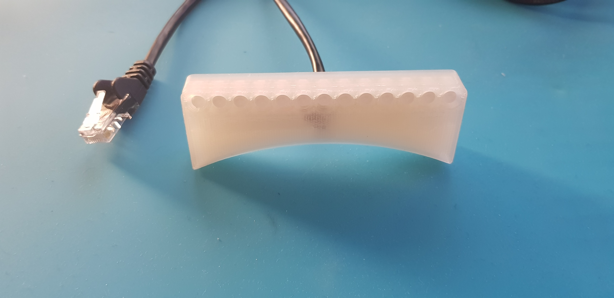

# OBDShiftIndicator
OBDShiftindicator is 

  - An indicator for gearshift in your car (widely know in race cars)
  - Working in every car that has an OBD2 port
  - Open Source
  - Developed as a hobby project 

Video:

# Complete Project!

  - The Project contains anything you need to build a working shiftindicator on your own including a pcb, a housing and code for running it.
  - It was developed over a long period as a hobby and is constantly improving
  - Just plug it into your cars' OBD2 port and connect the shiftlights via the RJ45 connector.
  

# Four Main Components

The ShiftIndicator consists of three main components

* PCB for mainboard and shitindicator-board
* 3D printed housing (designed for a mini cooper (easy to be adapted))
* Code for microcontroller
* Code for an android app to controll it and see telematic data

# Features
The Hardware and Software featues:
* quiescent current safety. when the obd gateway shuts down, the can tranciever shuts off the 12Vto5V voltage regulator
* low standby current consumption -> it consumes arround 60uA while standby
* when the car can wakes up, it automatically wakes up the hardware
* fused input
* OTA update capability
* Bluetooth connection to your android phone to control brightness, switch on and off and see some telematic data

# 3D Housing

The 3D housing was designed in solid edge. Besides the solid edge files the .stl files are provided. They can straight up be printed. 
The files can also be imported in fusion360 and modified.

# Hardware
The hardware was created with EasyEDA. Gerbers and a BOM are provided. The shiftlight is connected via RJ45 to the mainboard. On one end, the cable has to be cut and soldered to the shiftligh-pcb.

# Code

The code was developed using the arduino core for the esp32. For multithreading FreeRTOS was used. 
The provided platformIO projekt will manage all required libraries.

# Contribution
I would be very happy if there are some interested people who like this project and maybe even try it yourself. Since the system itself was developed for a mini cooper, there are certainly things that should be adapted if it should be used in other vehicles (rpm, 3d housing, etc.). For questions, I am always available.
